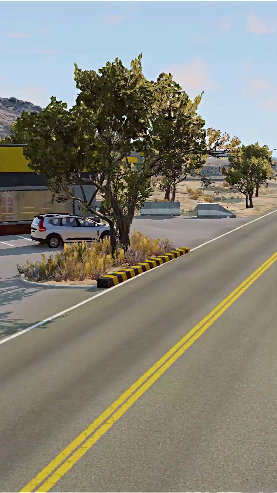
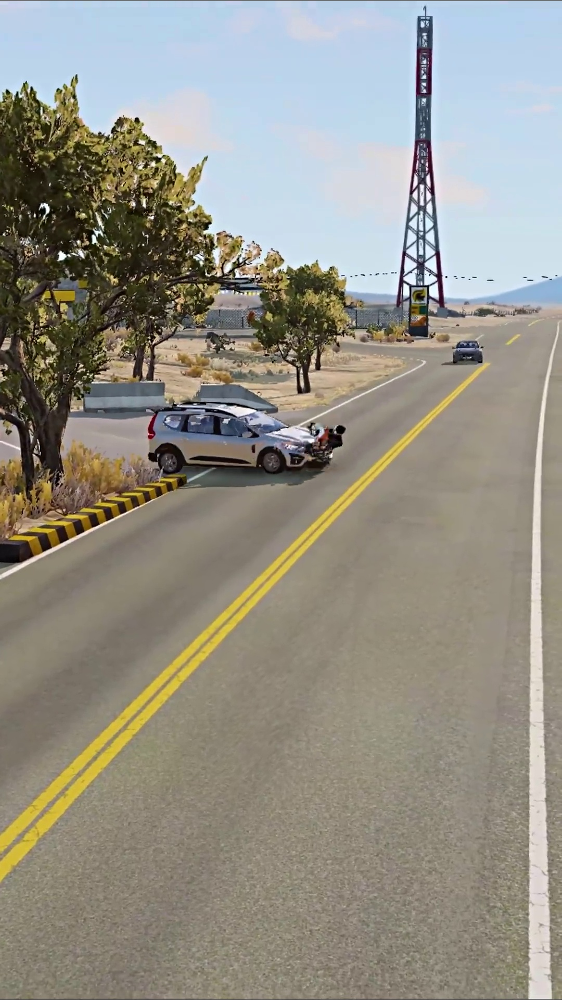
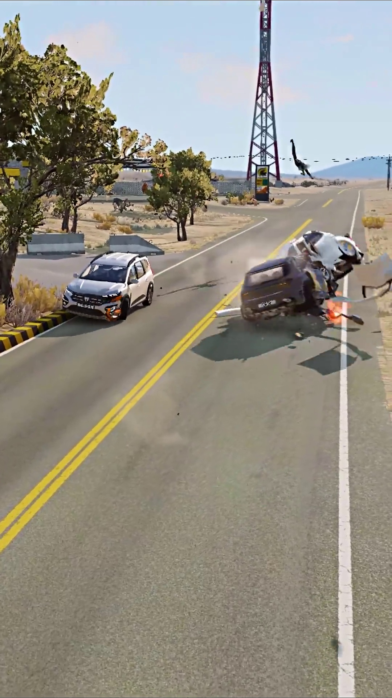
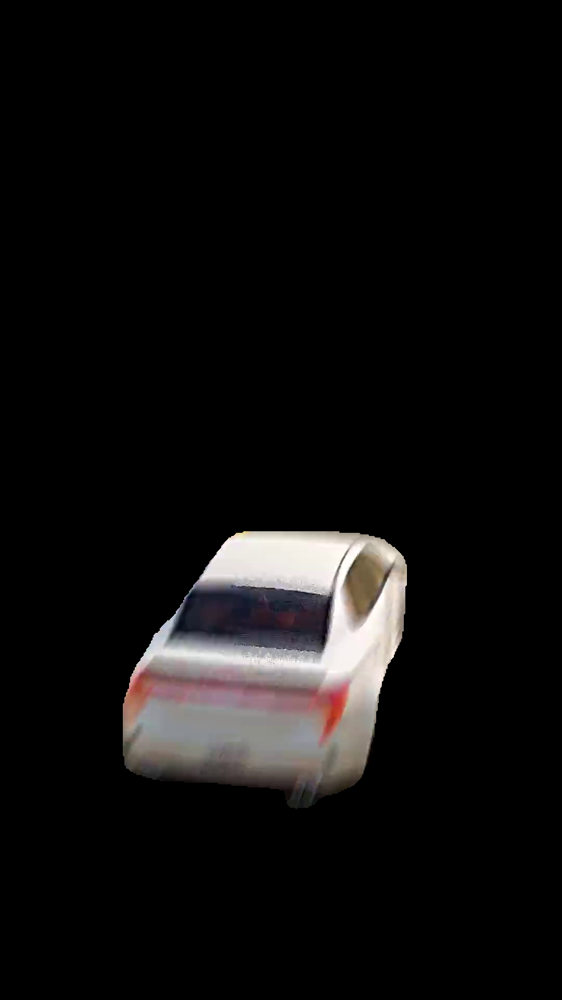
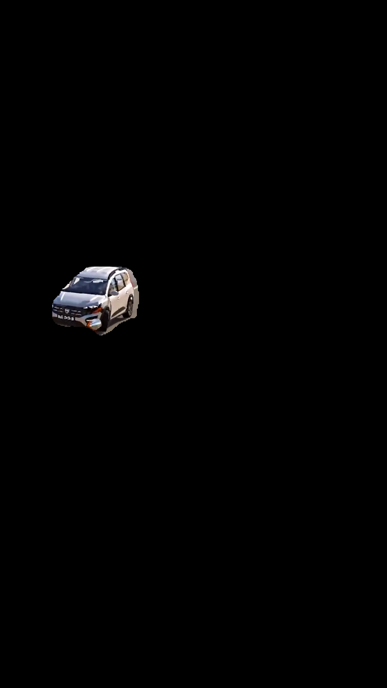
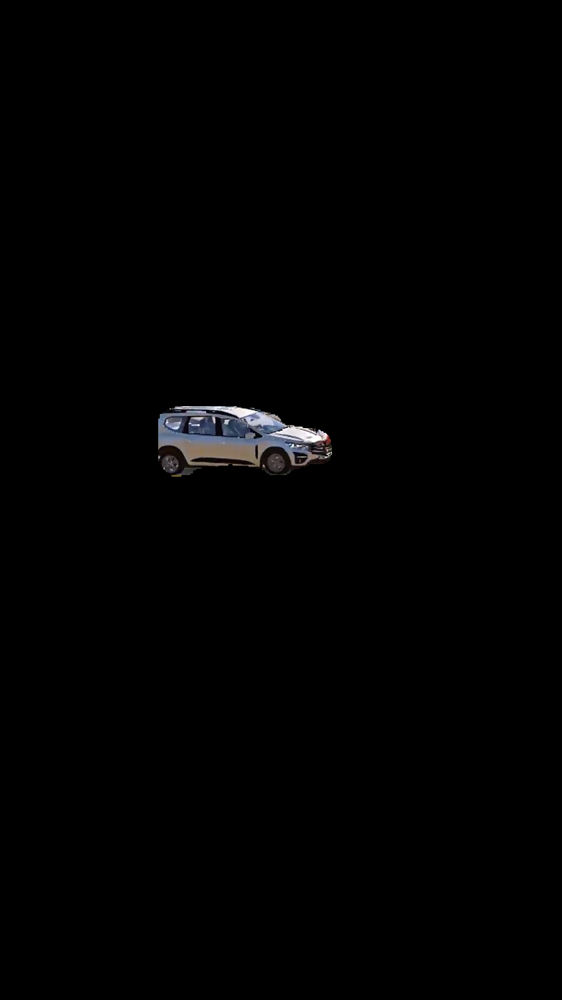

# Multi-Object Image Retrieval Using ROI Segmentation

## 📖 Overview

This project is a **Multi-Object Image Retrieval System** developed using **Python, OpenCV, and YOLOv8**. It extracts frames from a video, segments objects using ROI segmentation, performs color-based object retrieval, and extracts the selected objects efficiently.

## ✨ Features

- Frame Extraction
- Object Segmentation
- Color-Based Object Retrieval
- Object Extraction
- Multi-Object Detection

## 🛠 Technologies Used

- Python
- OpenCV
- YOLOv8
- NumPy

## ▶️ Installation

```bash
pip install -r requirements.txt
```

## ▶️ Run

```bash
python frame_extract.py
python object_segmentation.py
python colour_retrieval.py
python object_extraction_final.py
```

## 📸 Sample Outputs

### Frame Extraction







### Object Segmentation








## 📁 Repository Note

Only **sample output images** are included in this repository.

The complete frame extraction and object segmentation outputs contain thousands of generated images and are intentionally excluded to keep the repository lightweight. These outputs can be generated by running the provided Python scripts.

## 👥 Team Members

- Dhinesh M
- S. Vijayan
- E. Vignesh

## 🎓 Project Information

**Course:** B.Tech Artificial Intelligence and Data Science (AI&DS)  
**Project Type:** Final Year Major Project  
**Academic Year:** 2022–2026
